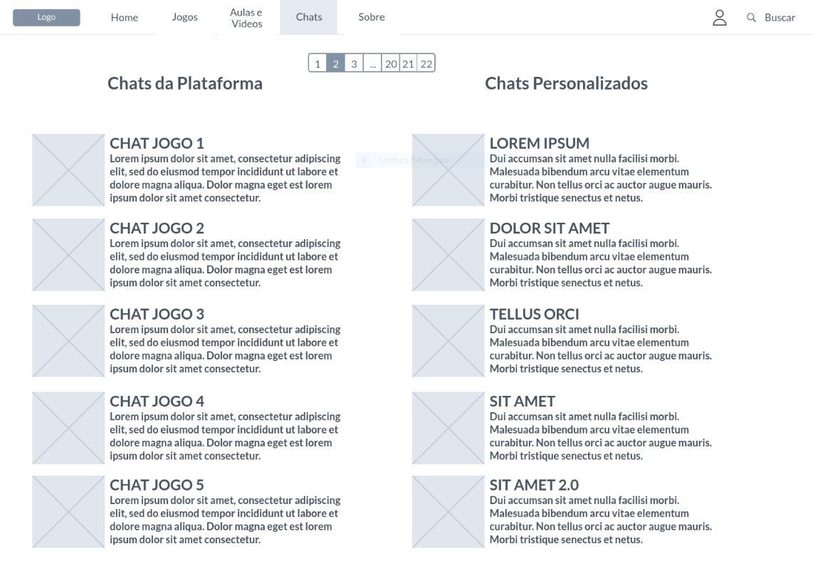

# Informações do Projeto
`TÍTULO DO PROJETO`  

......  iGame ......

`CURSO` 

......  Ciência da Computação ......

## Participantes

......  
- Arthur Justino Dias
- Bernardo Matosinhos de Andrade Peixotos
- Giovanni Purri Vecchio
- Lucca Costa Val Camarano
- Luccas Feres de Carvalho
- Rafael Lana Mascarenhas Diegues ......

# Estrutura do Documento

- [Informações do Projeto](#informações-do-projeto)
  - [Participantes](#participantes)
- [Estrutura do Documento](#estrutura-do-documento)
- [Introdução](#introdução)
  - [Problema](#problema)
  - [Objetivos](#objetivos)
  - [Justificativa](#justificativa)
  - [Público-Alvo](#público-alvo)
- [Especificações do Projeto](#especificações-do-projeto)
  - [Personas e Mapas de Empatia](#personas-e-mapas-de-empatia)
  - [Histórias de Usuários](#histórias-de-usuários)
  - [Requisitos](#requisitos)
    - [Requisitos Funcionais](#requisitos-funcionais)
    - [Requisitos não Funcionais](#requisitos-não-funcionais)
  - [Restrições](#restrições)
- [Projeto de Interface](#projeto-de-interface)
  - [User Flow](#user-flow)
  - [Wireframes](#wireframes)
- [Metodologia](#metodologia)
  - [Divisão de Papéis](#divisão-de-papéis)
  - [Ferramentas](#ferramentas)
  - [Controle de Versão](#controle-de-versão)
- [**############## SPRINT 1 ACABA AQUI #############**](#-sprint-1-acaba-aqui-)
- [Projeto da Solução](#projeto-da-solução)
  - [Tecnologias Utilizadas](#tecnologias-utilizadas)
  - [Arquitetura da solução](#arquitetura-da-solução)
- [Avaliação da Aplicação](#avaliação-da-aplicação)
  - [Plano de Testes](#plano-de-testes)
  - [Ferramentas de Testes (Opcional)](#ferramentas-de-testes-opcional)
  - [Registros de Testes](#registros-de-testes)
- [Referências](#referências)

# Introdução

## Problema

......  Nos dias de hoje, cada vez mais, as pessoas se interessam por diversos tipos de games, que variam entre diversas áreas e maneiras de se jogar.
Devido a esse fato e também as constantes atualizações de jogabilidade e maneiras para raciocinar em missões que decidimos então criar uma plataforma que
irá ajudar e auxiliar os gamers a aprender como jogar alguns jogos, compartilhar tutoriais entre si, como passar de certas missões, e tambem a aprender a
história de alguns deles, iremos comentar e recomendar diversos produtos que estão sendo jogados e que também podem crescer. ......

## Objetivos

......  Nos temos como objetivo tornar esse projeto em um portal de games nacional onde gamers de todos os estilos de jogo, todas as idades e todos os
gêneros consigam compartilhar e receber conhecimento sobre o mundo dos videogames. Nos vamos utilizar  mecanismos muito bem conhecidos de divulgação no 
mesmo estilo de outros gigantes sites de informação como Skillshare e YouTube. ......

## Justificativa

......  Neste projeto buscamos resolver um problema recente que, em nossa visão, tem um potencial muito grande para se tornar um grande negócio no
futuro próximo. O problema em questão é a dificuldade ou até mesmo a falta de paciência dos nossos clientes alvos de aprender a jogar vídeo games. Não é 
novidade que o mercado de vídeo games que surgiu nem a 40 anos atrás é um dos mercados que mais cresce no mundo anualmente, e com isso em mente pensamos
qual seriam as maiores dificuldades das pessoas que estão entrando nesse mundo agora. 
           Os jogos de antigamente eram consideravelmente intuitivos, com mecânicas simples e diretas, mas com o passar dos anos vão surgindo cada vez mais 
jogos que desafiam até os jogadores mais árduos. Nosso projeto servirá tanto para novos jogadores que desejam se aprofundar no mundo dos games quanto para os
jogadores ‘hardcore’ que desejam passar os maiores apertos dentro dos videogames. ......

## Público-Alvo

......  Nosso público alvo são aqueles que desejam melhorar sua habilidades e conhecimentos em algum jogo, seja um iniciante ou profissional. Teremos diversas
categorias de jogos em nosso site para assim podermos atingir o maior número de usuários possível, desde jogos de estratégia até MMO's. 
        Estamos procurando pessoas que já estão familiarizadas com o mundo dos videogames, seja a partir de notícias na televisão, de uma infancia repleta de 
videogames, de um irmão mais velho que joga ou até mesmo pessoas com curiosidade em desbravar o mundo dos games. ......

# Especificações do Projeto

......  Estamos criando um site imersivo e responsível onde os gamers se sintam a vontade de compartilhar o que sabem e procurar descobrirem coisas novas. Esse
ambiente será criado a partir da integração de usuários dentro do site, assim você poderá se comunicar com outros gamers. ......

## Personas e Mapas de Empatia

......  As personas nos ajudaram a mapear quias são os tipos de clientes que nós iremos buscar. Com essa informação em mente já podemos ocmeçar a mudar o nosso site
para se encaixar mais com as visões das personas. ......

<table>
<thead>
<tr class="header">
<th></th>
<th><strong>Gabriel Vall Rocha</strong></th>
<th></th>
</tr>
</thead>
<tbody>
<tr class="odd">
<td></td>
<td>
<strong>Idade</strong>: 21

<strong>Ocupação</strong>: Gabriel é um cara tímido, curioso e muito estudioso. Um pouco antissocial. Prefere fazer coisas incomuns para jovens de sua idade.
</td>
<td>
Aplicativos:

<ul>
<li><blockquote>

Instagram.

</blockquote></li>
<li><blockquote>

TikTok.

</blockquote></li>
<li><blockquote>

Twitter.

</blockquote></li>
<li><blockquote>

SnapChat.

</blockquote></li>
</ul></td>
</tr>
<tr class="even">
<td>
Motivações

<ul>
<li><blockquote>

Construir uma carreira no ramo de computação.-

</blockquote></li>
<li><blockquote>

Ter tempo para praticar seus hobbies.

</blockquote></li>
<li><blockquote>

Ficar cada vez melhor nos seus jogos favoritos.

</blockquote></li>
</ul></td>
<td>
Frustrações

<ul>
<li><blockquote>

Faculdade muito puxada

</blockquote></li>
<li><blockquote>

Achar tempo para jogar.

</blockquote></li>
<li><blockquote>

Medo de aos poucos parar de jogar videogame devido aos estudos.

</blockquote></li>
<li><blockquote>

Gastar muito tempo jogando e ir mal na faculdade.

</blockquote></li>
</ul></td>
<td>
Hobbies, História

<ul>
<li><blockquote>

Jogar futebol.

</blockquote></li>
<li><blockquote>

Jogar videogames.

</blockquote></li>
</ul></td>
</tr>
</tbody>
</table>

## Histórias de Usuários

Com base na análise das personas forma identificadas as seguintes histórias de usuários:

|EU COMO... `PERSONA`| QUERO/PRECISO ... `FUNCIONALIDADE` |PARA ... `MOTIVO/VALOR`                 |
|--------------------|------------------------------------|----------------------------------------|
|Usuário             | Registrar meus jogos jogados       | Conseguir achar aulas mais rápido      |
|Usuário             | Poder mandar mensgaens             | Comunicar com outros usuários          |
|Usuário             | Ter acesso rápido as aulas         | Economizar tempo                       |
|Usuário             | Ser fácil de usar                  | Clientes não saírem do site            |
|Usuário             | Ser estéticamente agradável        | Ser apelativo para todos               |
|Adminsitrador       | Conseguir alterar os jogos         | Para ter novos jogos semanalmente      |
|Administrador       | Conseguir alterar configuraçoes de chats | Para regular os chats particulares|

## Requisitos

As tabelas que se seguem apresentam os requisitos funcionais e não funcionais que detalham o escopo do projeto.

### Requisitos Funcionais

|ID    | Descrição do Requisito  | Prioridade |
|------|-----------------------------------------|----|
|RF-001| Permitir que o usuário se cadastre  | ALTA | 
|RF-002| Poder mandar mensagens   | ALTA | 
|RF-003| Permitir que os usuários tenham acesso ao conteúdo publicado   | ALTA |
|RF-004| Permitir que os usuários interajam um com os outros   | MÉDIA |
|RF-005| Ser fácil de usar   | MÉDIA |
|RF-006| Permitir que os usuários comentem no conteúdo   | BAIXA | 
|RF-007| Ser esteticamente agradável   | BAIXA | 
|RF-008| Ter acesso rápido as aulas   | BAIXA |

### Requisitos não Funcionais

| ID      | Descrição do Requisito                                                                                        |   Prioridade   |
| ------- | ------------------------------------------------------------------------------------------------------------- | -------------- |
| RNF-01  | O site deve ser publicado em um ambiente acessível publicamente na Internet (Repl.it, GitHub Pages, Heroku);  | ALTA           |
| RNF-02  | O site deverá ser responsivo permitindo a visualização em um celular de forma adequada.                       | ALTA           |
| RNF-03  | O site deve ter bom nível de contraste entre os elementos da tela em conformidade.                            | MÉDIA          |
| RNF-04  | O site deve ser compatível com os principais navegadores do mercado (Google Chrome, Firefox, Microsoft Edge). | ALTA           |
| RNF-05  | O site deve ter uma estética boa, a fim de atrair usuários.                                                   | ALTA           |
| RNF-06  | O site deve ser uma experiência divertida para os usuários.                                                   | MÉDIA          |

## Restrições

O projeto está restrito pelos itens apresentados na tabela a seguir.

|  ID    | Restrição                                                                   |
| ------ | --------------------------------------------------------------------------- |
| RE-01  | O projeto deverá ser entregue no final do semestre letivo. |
| RE-02  | O aplicativo deve se restringir às tecnologias básicas da Web no Frontend. |
| RE-03  | A equipe não pode subcontratar o desenvolvimento do trabalho.  |
| RE-04  | Falta de recursos financeiros para aprimorar recompensas. |                                

# Projeto de Interface

......  A interface do site será feita de uma maneira prática e facil de ser entendida por qualuqer um, visto que nos buscamos alcançar clientes
de todas as idades, inclusive crianças. A seguir estarão as três mecânicas mais importantes da nossa interface

...... A home será onde o usuário terá acesso rápido às principais mecânicas do site, sendo o nosso hub geral de informações. .......

...... Essa página será o centro de todas as videoaulas e aulas do site, todas as informações sobre jogas, jogadores, etc. serão passadas por essa página. ......

...... Essa página será responsável pela comunicação geral do site, seja entre os clinetes e os desenvolvedores, ou entre os próprios clientes. ......

## User Flow

......  
 ......

## Wireframes

......

Tela de Sign up: Nesta tela o usuário fara seu cadastro, caso ele já seja cadastrado basta clicar em “Já tenho conta”. 

.

Tela de Sign in: Nessa tela usuários já cadastrados irão logar em suas contas. 

.

Tela de Assinaturas: Nessa tela você poderá escolher o plano que utilizará.  

.

Tela Home: A home será onde o usuário terá acesso rápido às principais mecânicas do site, sendo o nosso hub geral de informações. 

.

Tela de Jogos: A tela de jogos será responsável por apresentar aos consumidores todos os jogos que o site terá em seu banco de dados de uma maneira prática e inteligente. 

.

Tela de Aulas e Vídeos: Essa página será o centro de todas as videoaulas e aulas do site, todas as informações sobre jogas, jogadores, etc. serão passadas por essa página. 

.

Telas de Chats: Essa página será responsável pela comunicação geral do site, seja entre os clinetes e os desenvolvedores, ou entre os próprios clientes.

.

Tela Sobre: Nesta tela iremos contar quem nós somos, de onde viemos e qual é nosso objetivo com o site. 

.

Tela de Perfil do Usuário: Essa tela será responsável por mostrar os principais dados do usuário, além de outras informações que ele achar cabível (será personalizável nas configurações). 

.

Tela de Buscar: Essa tela será responsável de facilitar a utilização do site permitindo o usuário pesquisar por palavra chave para encontrar qualquer conteúdo, jogo ou aula dentro da plataforma. 
......

# Metodologia

......  Nossa metodologia foi o Scrum Framework e o Design Thinking, onde desenvolvemos as informações nescessárias para começarmos a
construir o projeto. Criamos personas e mapas de stakeholders, além de criar uma matriz csd para entendermos o que conehciamos do nosso próprio produto.
        Durante esse processo a maioria dos participantes do grupo tiveram debates para decidir qual seria o rumo que tomariamos com o projeto. Decidimos seu nome, qual seria sua finalidade, quais seriam suas principais mecânicas, quais seriam os dispositivos que o site funcionaria, entre diversos outros temas. Este documento
apresenta diversas das decisões que tomamos já concretizadas.  ......

## Divisão de Papéis

......  A equipe utiliza metodologias ágeis, tendo escolhido o Scrum como base
para definição do processo de desenvolvimento.

O quadro kanban foi feito no Trello (link:https://trello.com/b/aWMYKPcc/tiaw-ag):

A equipe está organizada da seguinte maneira:

  - > Scrum Master: Rommel Carneiro 

  - > Product Owner: Rafael Lana Mascarenhas Diegues

  - > Equipe de Desenvolvimento
    
      - > Luccas Feres de Carvalho (Desenvolvedor Front End)
    
      - > Lucca Costa Vall Camarano (Desenvolvedor Front End)
    
      - > Bernardo Matosinhos de Andrade Peixoto (Desenvolvedor Front End)
    
      - > Arthur Justino Dias (Desenvolvedor Back End)
       
      - > Giovanni Purri Vecchio (Desenvolvedor Back End)
......

## Ferramentas

......

| Ambiente  | Plataforma              |Link de Acesso |
|-----------|-------------------------|---------------|
|Processo de Design Thinking | Miro |  https://miro.com/welcomeonboard/SFlMVnVhV1U2SXFYQndlWmRBdjR3ZGlEUnZJcUp3b0Y1MDZKVU90ektBeG55RGlUR2lBQUxSdXg4d255SE1tOXwzNDU4NzY0NTIyNDg2NTQ0NTkwfDI=?share_link_id=954359008594 | 
|Repositório de código | GitHub | https://github.com/ICEI-PUC-Minas-PPLCC-TI/tiaw-ppl-cc-m-20222-aprender-games.git  |
|Hospedagem do site | Heroku |  Ainda não temos site publicado | 
|Protótipo Interativo | MavelApp | https://marvelapp.com/prototype/b65i7bj | 
......

## Controle de Versão

......  Nos utilizamos as strings e mains do Git e GitHub para o controle da versão e de todos os outros aspectos do trabalho, incluindo documentação, apresentação, relatório e concepção.  ......

> 

# **############## SPRINT 1 ACABA AQUI #############**

# Projeto da Solução

......  O projeto da solução se consistiu em criar um hub de vídeos para os consumidores terem um acesso mais rapido e específico ao seus jogos preferidos ......

## Tecnologias Utilizadas

......  Nos utilizamos da linguagem de marcação HTML para a criação de um site que pegue os principais jogos competitivos do momento e fornece, semanalmente, os 9 melhores vídeos educativos sobre o conteudo. Neste site utilizamos também a linguagem de estilo CSS para a construção de um design mais simples e moderno que comunique melhor com nossos futuros consumidores. Também usamos a linguagem de programação JavaScript para criar sites responsivos e mais dinâmicos, além de implementar uma funcionalidae de registro de entidades para a criação de usuários no site. ......

## Arquitetura da solução

......  Optamos por um design mais simples e direto, de uma maneira onde a comunicação para o consumidor é mais direta e mais fácil. Optamos por uma hpme principal onde os jogos contidos no site estarâo sendo demonstrados, lá você poderá escolher um jogo e ser levado para uma página exclusiva para ele onde os vídeos e aulas se encontrarão. .......

# Avaliação da Aplicação

......  Testamos se todos os href estavam levando o consumidor para o endereço certo, visto que nosso site se trata de um hub para outros meios de comunicação essa é a aplicação fundamental (testado dia 03/12). Também testamos o cadastro e login de usuários possibilitados via Codepen.io (testado dia 03/12). ......

## Plano de Testes

......  
        1. Teste das funcionalidades das Classes: Buttons. (FUNCIONAL)
        2. Teste da funcionalidade dos cadastro de entidades. (FUNCIONAL)   
        3. Teste da presença de todas as imagens e links servidos via href. (FUNCIONAL)
......

## Ferramentas de Testes (Opcional)

...... VSCode e Replit. ......

## Registros de Testes

......  Nós não registramos os testes alpha, visto que o site ainda esta em beta. ......

# Referências

......  
- Skillshare - https://www.skillshare.com/pt/membership/checkout
- YouTube - https://www.youtube.com/
......
